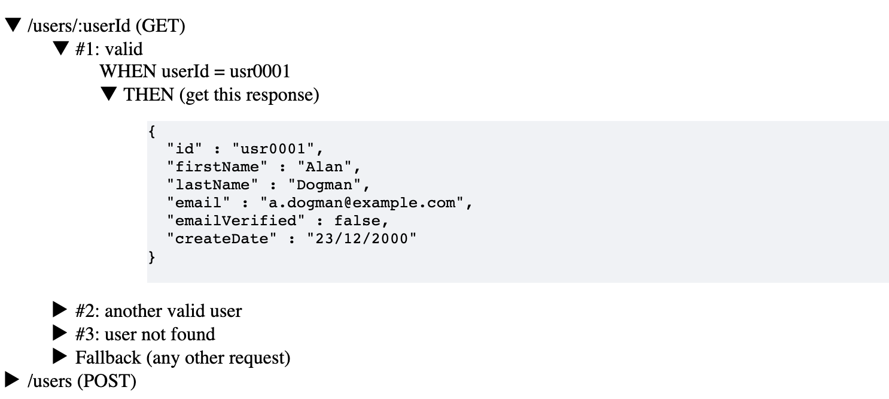

# OpenAPI Native Mock Server

Lightweight mock server created from an OpenAPI specification. 

Why **native**? Because the request-response interactions are defined within the OpenAPI file, without
the need for an additional application or storage (and therefore complexity). No external dependencies.

The request-response interactions (aka the contracts) are defined by parsing the OpenAPI examples, see [mapping strategies](#how-it-works).
A fallback response is generated to ensure every request receives always a response.

It is:
* **lightweight**: it runs in a single (small) container
* **fast**: it creates behind the scenes a Go service with a minimal footprint
* **simple**: it displays the mock expectations on the index page. Inspect the JSON payload of all mocked responses.

## Use cases

It can be used in different scenarios:
* you are developing an API SDK and need to implement solid integration testing: try it out with [TestContainers](https://github.com/gcatanese/openapi-testcontainers).
* you are building APIs and want to help your API consumers during the integration: make a mock server (that implements the API contract) readily available.
* you are developing an application that uses a third-party API dependency: mock the API to make your development faster and more efficient.

## Usage

### Build and run with Docker

Build the mock server from your OpenAPI file:
```docker
docker build --build-arg openapifile=/path/openapiFile.yaml -t openapi-native-mock-server .
```

Run the container:
```docker
docker run --rm -d -p 8080:8080 --name openapi-native-mock-server openapi-native-mock-server
```

Point your API requests to the mock server:
```shell
curl -X POST -H "Content-Type: application/json" \
 -d '{"name":"abc","country":"abc"}' \
   http://localhost:8080/{your_api_endpoint}
```

### Build and run from source

Build the mock server (**Note**: requires Java 11)
```shell
mvn package
```

Generate the mock server passing the path of the OpenAPI file (i.e. `-i openapi/tmp/openapi.yaml`) and the
folder that will contain the mock server source code (i.e. `-o openapi/tmp/go-server`):
```shell
java -cp target/openapi-native-mock-server.jar:openapi/cli/openapi-generator-cli.jar \
 org.openapitools.codegen.OpenAPIGenerator generate -g com.tweesky.cloudtools.codegen.NativeMockServerCodegen \
  -i openapi/tmp/openapi.yaml -o openapi/tmp/go-server
```

Run the mock server (**Note**: requires Go 1.19):

```shell
cd openapi/tmp/go-server
go mod tidy
go run .
```

Point your API requests to the mock server:
```shell
curl -X POST -H "Content-Type: application/json" \
 -d '{"name":"abc","country":"abc"}' \
   http://localhost:8080/{your_api_endpoint}
```

### Mock server browser

Access the index page to view the OpenAPI file (which the mock server has been created from) 
and the mock expectations:
```shell
curl http://localhost:8080/index/
```
The `index` page provides a view of the contract interactions, making clear the expectations.
Check it out.




## How it works

The module uses the [OpenAPI Generator](https://github.com/OpenAPITools/openapi-generator) to generate a lightweight 
mock server based on the OpenAPI specification. The request and response examples are found and matched to define the 
interactions (contract) between the consumer and the producer of the API.  

The following strategies are applied (in order) to match requests with responses:
* **match by Contract tag**: do the examples use the vendor extension `x-contract-id`? In this case, match a request with a response example that has the same value
* **match by Ref name**: match `$ref` request example with a corresponding `$ref` response example, for example 
`create-users-example` would match `create-users-example-200` to define a successful `200` scenario
* **match by Example name**: find request and response examples that have the same name
* **generate from Schema**: fallback strategy (when no matching is found): generate the response from the Schema and
ensure every request has at least a response.


## References

Check out the [Contract Testing with OpenAPI](https://medium.com/geekculture/contract-testing-with-openapi-42267098ddc7) article
to understand the challenges and solutions of Contract Testing with the OpenAPI standard.

